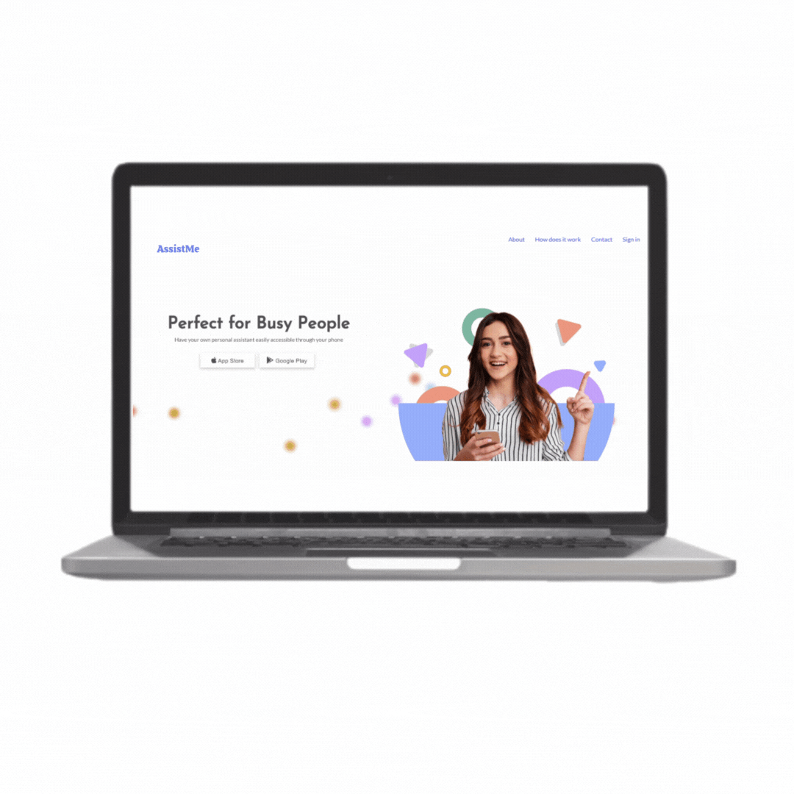

# AssistMe

This website is the landing page for a concept company whereby users could download an app and pay an assistant to do a task that they do not have the time to do.
The landing page has buttons that lead the user to a figma protoype, which displays the basic ux and ui of the app.

### Screenshot

### Links

- Live Site URL: [https://luzanne-s.github.io/AssistMe/]

## My process

### Built with

- Semantic HTML5 markup
- CSS custom properties
- Flexbox
- Javascript
- Figma
- Animate on Scroll
